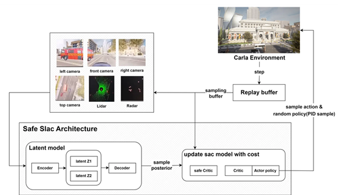
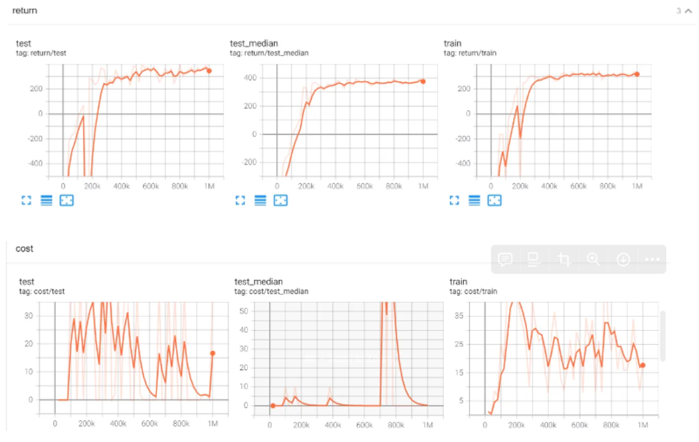

# carla deep RL self driving car project(sac,safe slac)

## 목적 
3D 도심 환경에서 안정적인 주행이 가능한 강화학습 기반 자율주행 기술 개발 강화학습 에이전트는 스스로 엑셀러레이터, 브레이크, 핸들 등을 제어하여 주어진 목적지까지 주행 하는 것이 목표이다 

## 실험 내용
carla town10hd 맵에서 화창한 날씨, 비오는 날씨, 밤 환경 총 3가지 환경에서 실험하였다

* 정해진 단일 경로 
  * **설정 방법**
    > carla_env.py create_actor 함수에서   
     self.target_pos.set_transform(random.choice(self.spawn_points))를 주석 하기   
        
        # while self.ego_vehicle is None:
        #     self.ego_vehicle = self.world.try_spawn_actor(ego_vehicle_bp, carla.Transform(carla.Location(-18.386, 130.21, 0.546),carla.Rotation(0.0, -180.0, 0.0)))
        #     # time.sleep(0.1)
        위에 코드 주석 하여 경로 고정 시키기 

   

* 신호등 시스템 포함 단일 경로 
  * **설정 방법**
    > carla_env.py create_actor 함수에서 고정 경로 처럼 경로 고정 하고   
        deal_with_reward_and_done 함수에서 주석 처리 되어있는 다음 코드   
    > 
         traffic light
        # if self.ego_vehicle.is_at_traffic_light():
        #    self.done = True
        #    cross_red_light_reward = -1.0
        # else:
        #    cross_red_light_reward = 0.0
        
        활성화 하고 return 부분에 cross_red_light_reward 추가 하면 된다
  
        예)self.reward = 0.1 * time_reward + 200.0 * arriving_reward + 2.0 * off_way_reward + 0.1 * speed_reward + 3.0 * steer_reward + 0.5 * lat_acc_reward + 3.0 * waypoints_len_reward + 100*cross_red_light_reward

        self.cost = 200.0 * collision_cost + 10.0 * lane_invasion_cost -100*cross_red_light_reward

        return self.reward, self.done, self.cost
        
        계수는 마음대로 정해도 괜찮다   
  

* 시작점 목적지 랜덤인 다중 경로 
  * **설정 방법**
    > carla_env.py create_actor 함수에서  
      self.target_pos.set_transform(random.choice(self.spawn_points))를 주석 해제 하기
        
        # while self.ego_vehicle is None:
        #     self.ego_vehicle = self.world.try_spawn_actor(ego_vehicle_bp, carla.Transform(carla.Location(-18.386, 130.21, 0.546),carla.Rotation(0.0, -180.0, 0.0)))
        #     # time.sleep(0.1)
  
        **주석 되어있는 다음 코드 주석 해제 하고 기존의 while self.ego_vehicle is None 코드는 주석 처리 한다**

## 개발 내용 

■ CARLA 시뮬레이터 환경을 구축하여 센서를 활용할 수 있도록 설정하고, 경로 탐색을 위한 플래너를 구현했다. 또한, 경로를 시각적으로 확인할 수 있도록 디스플레이 기능을 추가하여, 강화 학습에 활용할 수 있는 통합적인 시뮬레이션 환경을 완성했다.
경로 탐색 위해 A star algorithm 사용했고 차선 변경, 교차로 처리 위한 waypoint 구현했다 이외에도 칼라에서 제공하는 센서 처리등 환경에 필요한 기능을 우선적으로 구현하였다 

환경 구축 이후 

### 첫 번쨰로 시도한 일고리듬은 sac 알고리듬 

■ 성능 향상을 위해 SAC(Soft Actor-Critic)의 리플레이 버퍼를 PER(Prioritized Experience Replay) 버퍼로 변경하고, 하이퍼파라미터에 스케줄링을 도입하여 향상된 SAC 모델을 구축했다. 이를 CARLA 시뮬레이터 환경에 통합하는 작업을 진행했다.
하지만 CNN기법으로 이미지를 처리 하였기 때문에 학습 속도가 느리다는 단점이 있었다 또한 칼라환경에서 제공하는 여러 센서값들을 한번에 사용할수 없다는 문제도 있었다 

### 두번째 시도한 알고리듬 safe slac
칼라 환경에서 고려 할수있는 여러 센서 값들을 한번에 사용하기 위해 알고리듬을 slac로 변경 하였다 더 나아가 safe RL 관점을 더해서 cost 고려 하는 safe slac 알고리듬 사용한다 

사용하는 센서는 ['left_rgb','front_rgb', 'right_rgb','top_rgb','lidar','radar']로 총 6개이다 고차원 데이터를 한번에 처리 하기 위해 VAE(Variational Auto Encode) latent space에서 학습 한다 

아키텍쳐는 다음과 같다   

단일 경로에 대해서는 safe slac 그대로 사용한다  다만 학습 속도를 개선 하기 위해 해상도를 1080에서 720으로 낮추고 학습 진행 하였다 그리고 주변 챠량 개수와 사람 수도 같이 줄이고 학습을 돌렸다    
그리고 처음 random한 정책 실행 할때 pid 제어로 차량을 제어한 정책을 사용하여 초반에 데이터 질을 높이었고 이 초반 데이터를 기반으로 알고리듬이 진행된다
(controller.py)에 pid 제어 내용이 구현 되어있다 

safe RL 적용이 cost의 제약 형태로 적용이 된다 보상만 최대화 하는것이 아니라 cost의 제약도 같이 고려 하는 알고리듬입니다 다음은 보상과 비용함수에 대한 내용이다

다중 경로에 대한 학습 속도를 개선 하기 위해 병렬 학습을 고려하게 되었다 이를 위해 ray lib에서 제공하는 기능을 합쳤다 하지만 GPU를 여러대 사용할수있는 환경이 아니었기 때문에 아래와 같은 구조로 병렬 학습 진행하였다 

그리고 메모리 문제 때문에 out of memorry 문제가 계속 발생 하였다 그래서 해상도를 기존 1080에서 480으로 줄이고 차량 수 사람 수도 극단적으로 줄여서 칼라 환경에서의 메모리를 경량화 하였다 그리고 초기에 데이터 모으기 위해 학습하는 파라미터, 버퍼 사이즈 등 메모리 경량화를 위해 하이퍼 파라미터 수정을 많이 했다 
또한 칼라 시뮬레이터 퀄리티도 low버전으로 시뮬레이션 실행 하였다 

## 실험 결과

### 정해진 단일 경로 화창한 날씨

  

  

### 정해진 단일 경로 비오는 날씨   

  

### 정해진 단일 경로 밤 날씨   

  

### 다중 경로 화창한 날씨  
다중 경로를 위한 병렬 학습 코드는 시간 부족으로 학습을 끝까지 진행하지 못해서 결과를 낼수가 없었다 
다음은 학습을 진행한데까지의 내용이다 

## 추후 개선 사항 

1. 단일 경로에 시스템 시스템 추가한 경우 결과가 잘 나오지 않음
   2. 예상되는 문제는 단일 경로 학습할때 해상도를 줄였기 때문으로 생각 됨 원래 해상도를 유지 할때는 신호등이 미니맵에서 보였는데 해상도를 줄이면서 신호등이 미니맵에서 보이지 않으므로써 신호등을 인식 못했을 가능성이 있다 추가로 top rgb를 미니맵으로 변경 하여 확실히 인식 할수있도록 하여 학습 하면 결과가 달라질것으로 예상된다 

2. 병렬 학습 코드로 구현하였는데 시간 부족으로 완전히 학습을 마무리 하지 못하여서 지금 구현 한 병렬 코드가 완전히 문제가 있는지 확인 할 수 없었다 특히 병렬 학습 코드의 경우 OOM 문제를 해결하기 위해 하이퍼 파라미터 조정을 많이 하였다 이에대한 성능 저하도 있을것으로 예상된다 또한 학습 속도를 더 높이려면 분산 학습을 해야 할것으로 생각된다 
여러개의 GPU를 사용할수있는 환경이고 메모리도 충분히 여유있는 컴퓨팅 자원이면 실험을 더 진행 해볼수있을것 같다 

3. 물론 병렬 학습의 경우 최적화가 필요 할것 같다 현 시점에서는 어떻게든 병렬 학습으로 돌릴수있도록 ray lib에 맞게 코드 적용한것 뿐이라고 생각한다 ray lib적용하여 최적화 수행을 해준다면 더 개선이 될것으로 생각 된다 

## 참고 논문 및 코드 

[1] Tuomas Haarnoja1 Aurick Zhou1 Pieter Abbeel1 Sergey Levine Soft Actor-Critic: Off-Policy Maximum Entropy Deep Reinforcement Learning with a Stochastic Actor  

[2] Alex X. Lee1,2 Anusha Nagabandi1 Pieter Abbeel1 Sergey Levine11University of California, Berkeley2DeepMind Stochastic Latent Actor-Critic: Deep ReinforcementLearning with a Latent Variable Model  

[3] Yannick Hogewind, Thiago D. Simao, Tal Kachman & Nils Jansen ˜Radboud University, Nijmegen SAFE REINFORCEMENT LEARNING FROM PIXELSUSING A STOCHASTIC LATENT REPRESENTATION  

[safe slac 공식코드 주소](https://github.com/lava-lab/safe-slac)

[환경 및 코드 참고 주소](https://github.com/WeiZhang1988/safe-slac-for-e2e-autonomous-driving)

## 나의 역할 및 기여 

* 칼라 환경 구축
* sac with per buffer 구현 및 칼라 환경 통합
* safe slac 코드 와 칼라 환경 통합 
* safe slac 병렬 학습 위해 ray lib 적용 
